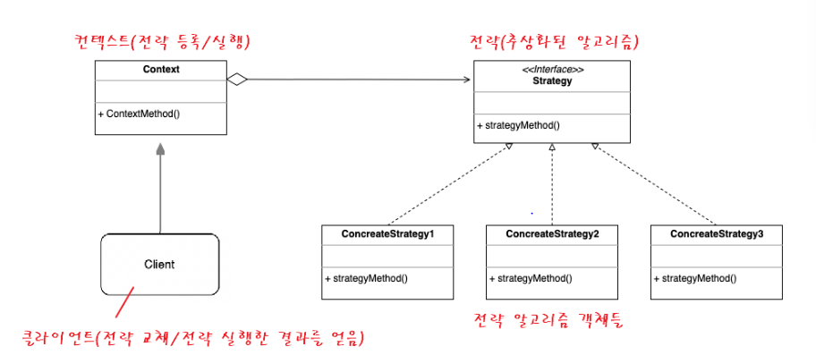
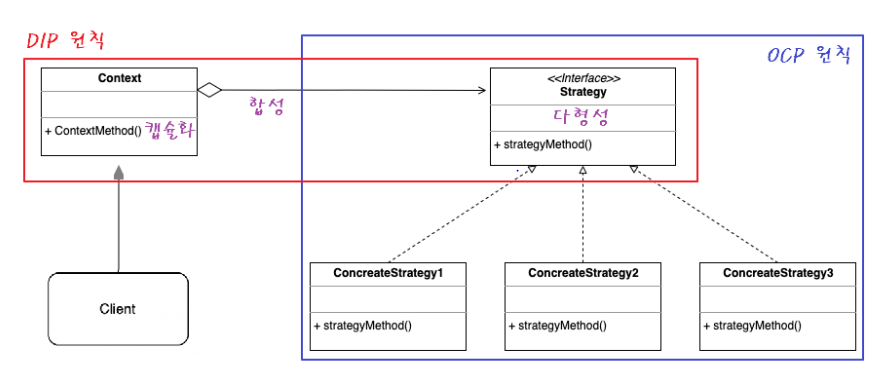
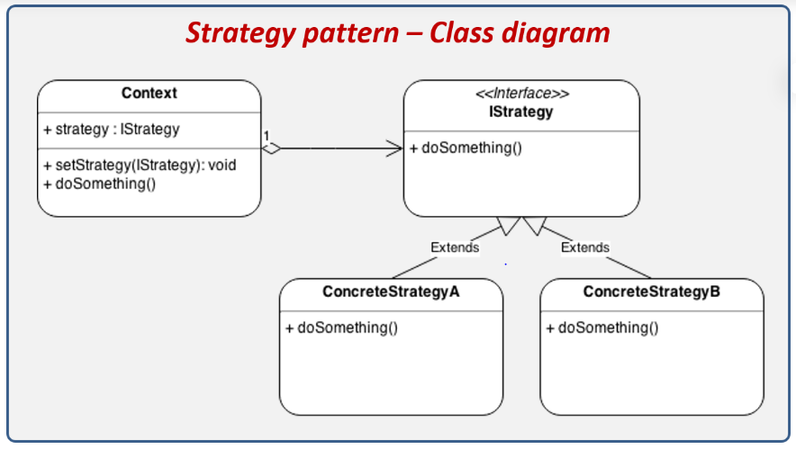
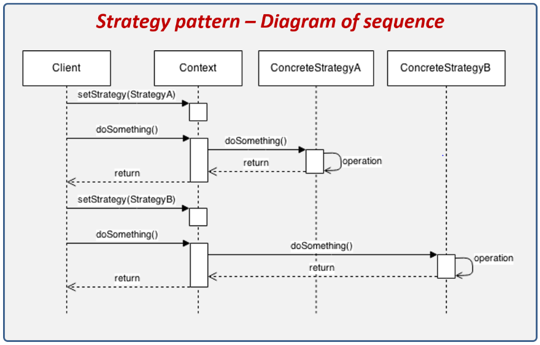

# 전략패턴(Strategy Pattern)

> 실행(런타임)중에 알고리즘 전략을 선택하여 객체동작을 실시간으로 바뀌도록 하는 방법
> 

: 객체들이 할 수 있는 행위 각각에 대해 전략 클래스를 생성하고, 유사한 행위들을 캡슐화하는 인터페이스를 정의하여 객체의 행위를 동적으로 바꾸고 싶은 경우 직접 행위를 수정하지 않고 전략을 바꿔주기만 함으로써 행위를 유연하게 확장하는 방법

>> 전략: 일종의 알고리즘이 될 수 있고, 기능이나 동작이 될 수도 있는 특정한 목표를 수행하기 위한 행동 계획
>> 객체가 할 수 있는 행위들 각각을 전략으로 만들고, 동적으로 행위의 수정이 필요한 경우 전략을 바꾸는 것만으로 행위의 수정이 가능
>> 알고리즘 변형이 빈번하게 필요한 경우 적합한 패턴!

## 구조



- 전략 알고리즘 객체들: 알고리즘, 행위, 동작을 객체로 정의한 구현체
- 전략 인터페이스: 모든 전략 구현체에 대한 공용 인터페이스
- 컨텍스트(Context)*: 알고리즘을 실행해야 할 때마다 해당 알고리즘과 연결된 전략객체의 메소드 호출
- 클라이언트: 특정 전략 객체를 컨텍스트에 전달 함으로써 전략을 등록하거나 변경하여 전략 알고리즘을 실행한 결과를 누린다.
    
    *컨텍스트란 콘텐츠를 담는 그 무엇인가를 뜻하며, 어떤 객체를 핸들링 하기 위한 접근수단.
    EX) 물컵에 물이 있으면 물은 콘텐츠, 물컵은 컨텍스트(물을 핸들링하기 위한 접근수단)
    

## 전략 패턴은 OOP(Object Oriented Programming)의 집합체

GoF의 디자인 패턴 책에서는 전략 패턴을 다음과 같이 정의한다.
1. 동일 계열의 알고리즘군을 정의하고
2. 각각의 알고리즘을 캡슐화하여
3. 이들을 상호 교환이 가능하도록 만든다.
4. 알고리즘을 사용하는 클라이언트와 상관없이 독립적으로
5. 알고리즘을 다양하게 변경할 수 있게 한다.

SOLID원칙의 OCP원칙, DIP원칙, 합성(composition), 다형성(polymorphism), 캡슐화(encapsulation)등 OOP기술의 총 집합 버전이라고 보면 된다!



따라서 위의 전략 패턴의 정의를 다음과 같이 빗대어 설명하면 이해하기 쉬울 것이다!
1. 동일 계열의 알고리즘군을 정의하고 **>> 전략 구현체로 정의** 
2. 각각의 알고리즘을 캡슐화하여 **>> 인터페이스로 추상화**
3. 이들을 상호 교환이 가능하도록 만든다. **>> 합성(composition)으로 구성**
4. 알고리즘을 사용하는 클라이언트와 상관없이 독립적으로 **>> 컨텍스트 객체 수정 없이**
5. 알고리즘을 다양하게 변경할 수 있게 한다. **>> 메소드를 통해 전략 객체를 실시간으로 변경함으로써 전략을 변경.**

## 전략 패턴의 흐름

### 클래스 구성



```java
//전략(추상화된 알고리즘)
interface IStrategy {
	void doSomething();
}

//전략 알고리즘 A
class ConcreteStrategyA implements IStrategy {
	public void doSomething() {}
}

//전략 알고리즘 B
class ConcreteStrategyB implements IStrategy {
	public void doSomething() {}
}
```

```java
//컨텍스트(전략 등록/실행)
class Context {
	IStrategy Strategy; //전략 인터페이스를 합성(composition)

	//전략 교체 메소드
	void setStrategy(IStrategy Strategy) {
		this.Strategy = Strategy;
	}

	//전략 실행 메소드
	void doSomething() {
		this.Strategy.doSomething();
	}
}
```

### 클래스 흐름

context: 물컵, strategy: 물(사람이 물 마실때 물을 만지지 않고 물컵을 사용한다는 것으로 이해)



```java
//클라이언트(전략 교체/전략 실행한 결과를 얻음)
class Client {
	public static void main(String[] args) {
		//1. 컨텍스트 생성
		Context c = new Context();
		
		//2. 전략 설정
		c.setStrategy(new ConcreteStrategyA());

		//3. 전략 실행
		c.doSomething();

		//4. 다른 전략 설정
		c.setStrategy(new ConcreteStrategyB());

		// 5. 다른 전략 시행
		c.doSomething();
	}
}
```

## 전략 패턴의 사용 시기

- 전략 알고리즘의 여러 버전 또는 변형이 필요할 때 클래스화를 통해 관리
- 알고리즘 코드가 노출되어서는 안되는 데이터에 액세스 하거나 데이터를 활용할 때(캡슐화)
- 알고리즘의 동작이 런타임에 실시간으로 교체되어야 할 때

## 전략 패턴의 주의점

- 알고리즘이 많아질수록 관리해야할 객체의 수가 늘어난다는 단점
- 만일 앱 특성이 알고리즘이 적고 자주 변경되지 않는다면 새로운 클래스와 인터페이스를 만들어 프로그램을 복잡하게 만들 이유가 없음!
- 개발자는 적절한 전략을 선택하기 위해 전략 간의 차이점을 파악하고 있어야 한다.(복잡도높음)

## 전략패턴과 템플릿 메소드 패턴의 차이점

### 유사점

- 전략 패턴과 템플릿 메서드 패턴은 알고리즘을 때에 따라 적용한다는 컨셉으로 둘이 유사
- 전략 및 템플릿 메서드 패턴은 OCP원칙을 충족하고 코드를 변경하지 않고 SW모듈을 쉽게 확장할 수 있도록 하는데 사용함

### 차이점

- 전략 패턴은 합성(composition)을 통해 해결책을 강구, 템플릿 메소드 패턴은 상속(inheritance)을 통해 해결첵을 제시
- 따라서 전략 패턴은 클라이언트와 객체 간의 결합이 느슨한 반면, 템플릿 메소드 패턴은 두 모듈이 더 밀접하게 결합이 된다.( 결합도가 높으면 안 좋음)
- 전략 패턴에서는 대부분 인터페이스를 사용, 템플릿 메소드 패턴은 주로 추상클래스나 구체적인 클래스를 사용
- 전략 패턴에서는 전체 전략 알고리즘을 변경할 수 있지만, 템플릿 메소드 패턴은 알고리즘의 일부만 변경되고 나머지는 변경되지 않은 상태로 유지된다(템플릿에 종속)
- 따라서 단일 상속만이 가능한 자바에서는 상속 제한이 있는 템플릿 메소드 패턴보다, 다양하게 많은 전략을 implements할 수 있는 전략 패턴이 협업에서 많이 사용되는 편이다.