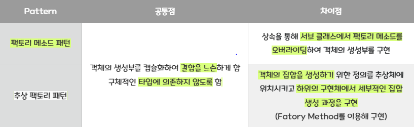
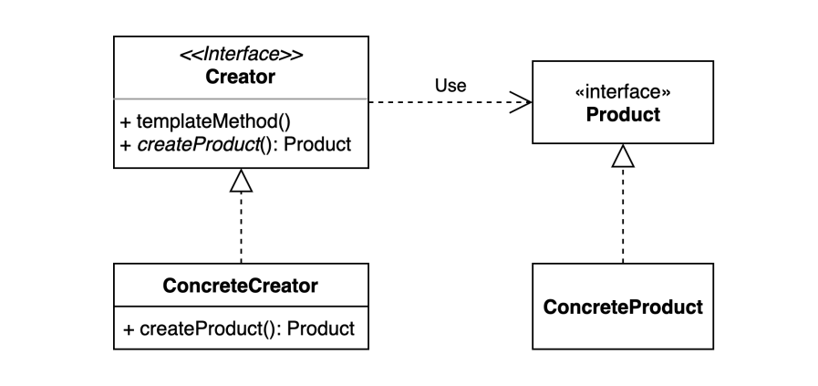

# 팩토리 메소드 패턴

- 팩토리 패턴의 두가지 종류
    
    
    

> 객체 생성을 공장(Factory) 클래스로 캡슐화 처리하여 생성하게 하는 생성 디자인 패턴
> 

: 즉, 클라이언트에서 직접 new 연산자를 통해 제품 객체를 생성하는 것이 아닌, 제품 객체들을 도맡아 생성하는 공장 클래스를 만들고, 이를 상속하는 서브 공장 클래스의 메서드에서 여러가지 제품 객체 생성을 각각 책임지는 것이다. 또한 객체 생성에 필요한 과정을 템플릿 처럼 미리 구성해놓고, 객체 생성에 관한 전처리나 후처리를 통해 생성 과정을 다양하게 처리하여 객체를 유연하게 정할 수 있는 특징도 있다.

부모(상위)클래스에 알려지지 않은 구체 클래스를 생성하는 패턴임. 자식(하위)클래스가 어떤 객체를 생성할지를 결정하도록 하는 패턴임. 부모(상위)클래스 코드에 구체 클래스 이름을 감추기 위한 방법으로도 사용함.



## 사용 이유

객체를 생성하기 위해 인터페이스를 정의하지만, 어떤 클래스의 인스턴스를 생성할지에 대한 결정은 서브클래스에서 이루어지도록 하여 재정의 가능한 것으로 설계하지만 복잡해지지 않게 한다.

1. 생성할 객체 타입을 예측할 수 없을 때
2. 생성할 객체를 기술하는 책임을 서브클래스에게 정의하고자 할 때
3. 객체 생성의 책임을 서브클래스에 위임시키고 서브클래스에 대한 정보를 은닉하고자 할 때

## 장점

1. 기존 코드를 수정하지 않고 새로운 인스턴스를 다른 방법으로 생성하도록 확장 가능
2. 코드가 간결해짐
3. 병렬적 클래스 계층도를 연결하는 역할

## 단점

1. 클래스가 많아짐( 클래스 계층이 커짐)
- 제품 클래스가 바뀔 때 마다 새로운 서브클래스를 생성해야함
2. 클라이언트가 creator 클래스를 반드시 상속하여 product를 생성해야 함

## 적용

수제화 가게를 운영해봅시다!!

```java
Shoes orderShoes(String name) {
     
    Shoes shoes;
    //바뀔 수 있는 부분 (if문)
    
    if (name.equals("blackShoes")) {
 
        shoes = new BlackShoes();
 
    } else if (name.equals("brownShoes")) {
 
        shoes = new BrownShoes();
 
    } else if (name.equals("redShoes")) {
 
        shoes = new RedShoes();
    }
 
    //바뀌지 않는 부분
    shoes.prepare(); // 신발을 준비하고
    shoes.packing(); // 종이 가방에 넣음
 
    return shoes;
}

// 현재 이 매장에는 3개의 신발만을 팔고 있습니다. 앞으로 판매되는 제품이 늘어나거나
// 지금 있는 제품이 판매가 더이상 안될수도 있죠. 즉 변경이 가능한 부분이어야합니다.
// 그러나 아래있는 prepare, packing은 변하지 않을 확률이 높슴니다. 
// 변하는 부분을 캡슐화를 해봅시다
 
public class ShoesFactory {
 
    public Shoes makingShoes(String name) {
 
       Shoes shoes = null;
 
    if (name.equals("blackShoes")) {
 
            shoes = new BlackShoes();
 
    } else if (name.equals("brownShoes")) {
 
              shoes = new BrownShoes();
 
    } else if (name.equals("redShoes")) {
 
              shoes = new RedShoes();
    }
        return shoes;
 
    }
 
}
// 팩토리로 분리하면?
public class ShoesStore {
     
    ShoesFactory factory;
 
    //생성자
    public ShoesStore(ShoesFactory factory) {
        this.factory = factory;
    }
   
    //주문하기
    Shoes orderShoes(String name) {
 
        Shoes shoes;
 
        shoes = factory.makingShoes(name)
        
        shoes.prepare(); // 신발을 준비하고
        shoes.packing(); // 종이 가방에 넣음
 
        return shoes;
    }
}

// 주문이 들어왔을 때 공장에 오더를 넣어서 받기만 하면 됨. 판매되는 신발에 변화가 생겼을 땐
// 공장에서 처리하게 한다!
// 이제시작입니다.
// 유명세를 타서 우리 수제화 가게가 다른 나라로 진출했습니다.
// 일본과 프랑스에서 매장이 열렸는데요.
JapanShoesStore jpStore= new JapanShoeStore (new JapanShoesFactory());
    jpStore.order("blackShoes");
    
    FranceShoesStore  frStore = new FranceShoesStore (new FranceShoesFactory());
    frStore.order("blackShoes");

// 이 매장들을 운영하다 보니까 각자 본사의 가이드라인대로 신발을 만들기는 하는데
// 일본에서는 구두에 용이 그려진 자수를 넣기도하고
// 프랑스에선 포장지를 다른걸 쓰는걸 발견했지뭡니까.?
// 그래서 본사는, 매장과 구두 생산 과정 전체를 묶어주는 프레임워크를 만들어습니다.

public abstract class ShoesStore {
 
    public ShoesStore orderShoes(String name) {
 
        Shoes shoes;
 
        shoes = makeShoes(name);
 
        shoes.prepare();
        shoes.packing();
 
        return shoes;
 
    }
 
    abstract Shoes makeShoes(String name);
 
}

// ShoesStore를 추상클래스 선언합니다. 이로써 모든 분점들에 똑같은 시스템이 진행됩니다.
// 달라지는 부분은 신발의 스타일입니다.
// 이 달라지는 부분은 어디서 구현할까요? 이 클래스를 상속받는 서브 클래스에서, 추상메소드로
// 선언한 makeShoes메소드를 오버라이드 하여 작업을 구현합니다.
// 이 메소드가 신발을 만드는 것을 책임지게 됩니다.

class JapanShoesStore extends ShoesStore {
 
    @Override
    Shoes makeShoes(String name) {
        // TODO Auto-generated method stub
        if (name.equals("blackShoes")) {
            return new JPStyleBlackShoes();
 
        } else if (name.equals("brownShoes")) {
 
            return new JPStyleBrownShoes();
 
        } else if (name.equals("redShoes")) {
 
            return new JPStyleRedShoes();
 
        } else {
 
            return null;
        }    }
}
//일본 신발 매장 클래스입니다.

class FranceShoesStore extends ShoesStore {
 
    @Override
    Shoes makeShoes(String name) {
        // TODO Auto-generated method stub
 
        if (name.equals("blackShoes")) {
            return new FRStyleBlackShoes();
 
        } else if (name.equals("brownShoes")) {
 
            return new FRStyleBrownShoes();
 
        } else if (name.equals("redShoes")) {
 
            return new FRStyleRedShoes();
 
        } else {
 
            return null;
        }
 
    }
}
//프랑스 신발 매장 클래스입니다.

//중요한 것은, 슈퍼클래스에 있는 orderShoes메소드에서는 어떤 신발이 만들어지는지
//전혀 모르고 있다는 것입니다. 그 메소드에서는 주는 신발을 받아서 준비하고 포장할뿐임.

// 그럼 이제 구두를 만들어볼까용
abstract class Shoes {
 
    String name;
    String bottom;
    String leather;
    boolean hasPattern;
 
    void prepare() {
 
        System.out.println("완성된 신발을 준비 중 입니다..");
    }
 
    void packing() {
 
        System.out.println("신발을 포장 하고 있습니다..");
    }
 
    public String getName() {
 
        return name;
    }
 
}
class JPStyleBlackShoes extends Shoes {
 
    public JPStyleBlackShoes() {
        // TODO Auto-generated constructor stub
 
        name = "일본 스타일의 검은 구두";
        bottom = "검은색 고무 밑창";
        leather = "소가죽";
        hasPattern = false;
 
    }
 
}
 
class FRStyleBlackShoes extends Shoes {
 
    public FRStyleBlackShoes() {
        // TODO Auto-generated constructor stub
 
        name = "프랑스 스타일의 검은 구두";
        bottom = "옅은 검은색의 플라스틱과 고무 혼용";
        leather = "양가죽";
        hasPattern = true;
 
 
    }
}

//이제 메인클래스로 테스트 신발을 주문해 봅시다.
public class ShoesTest {
 
    public static void main(String[] args) {
 
        ShoesStore jpStore = new JapanShoesStore();
        ShoesStore frStore = new FranceShoesStore();
 
        Shoes shoes = jpStore.orderShoes("blackShoes");
        System.out.println("일본 매장에서 산 구두는 ? --> " + shoes.getName());
        System.out.println();
 
        shoes = frStore.orderShoes("blackShoes");
        System.out.println("프랑스 매장에서 산 구두는 ? --> " + shoes.getName());
 
    }
}

//신발 주문 어떻게 했나요?
// 1. 일본에 놀러간 지원이는 수제화 매장에 방문합니다.(JPShoesStore의 인스턴스 생성)
// 2. 가게를 찾아서 주문을 함. 어떤 구두를 살 것인지 말합니다.(생성한 인스턴스를 통해 orderShoes메소드 호출)
// 3. 직원이 민수의 발 정보를 재고 신발을 만드는 작업자에게 주문 전달.(orderShoes메소드에서 makeShoes호출)
// 4. 완성됐지만 아직 포장되지 않은 신발을 받아서 깨끗하게 포장하여 나에게 전달.(prepare, packing메소드 호출)

```

위에서 보이듯, 하위 클래스에서 어떤 클래스를 만들지 결정하게 됩니다. 상위 클래스는 어떤 제품이 만들어지는지 전혀 알지 못합니다. 이것 때문에 “결정한다”라는 단어로 표현합니다.

정확히는, 사용하는 서브클래스에 따라 생산되는 객체 인스턴스가 결정할 것입니다.