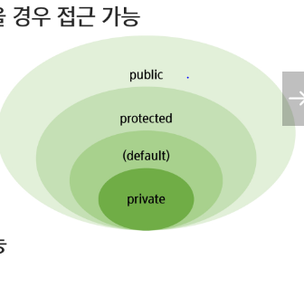
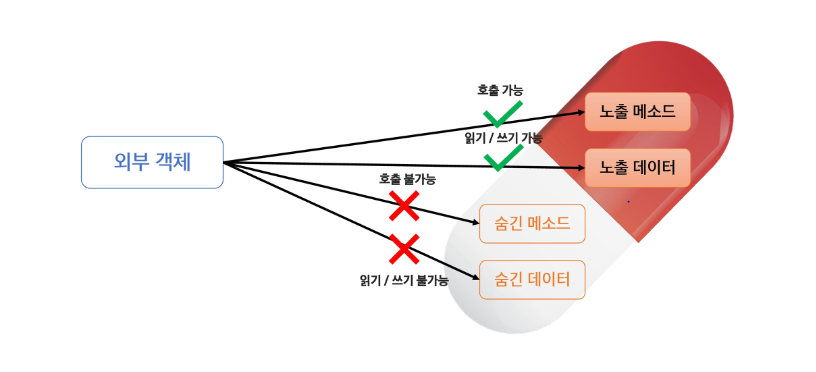
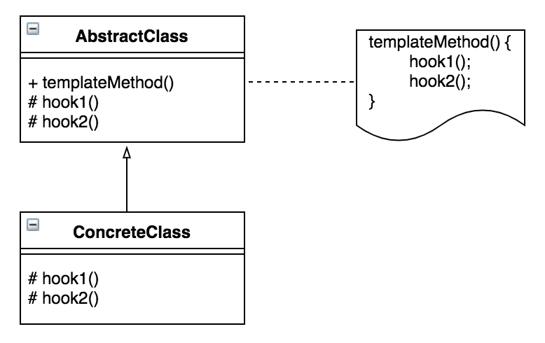
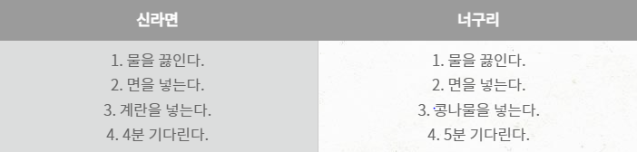
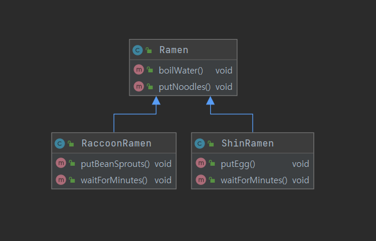
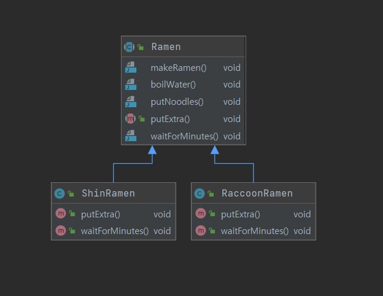

# 템플릿 메소드 패턴

- 하기전에! 접근제한자, 캡슐화를 먼저 보자
    
    ## 접근제한자
    
    > 클래스, 멤버변수, 멤버 메서드 등의 선언부에서 
    접근허용범위를 지정하는 역할의 키워드
    > 
    - 종류: public, protected, (default)(비워져있어야됨!!!), private
     >> 그 외 제한자: static(클래스 레벨의 요소 설정), final(수정불가), abstract(추상 메서드 및 추상 클래스 작성)
        1. public: 모든 위치에서 접근 가능
        2. protected: 같은 패키지에서 접근 가능. 다른패키지 접근 불가.단, 다른 패키지의 클래스와 상속관계가 있을 경우 접근 가능
        3. default: 같은 패키지에서만 접근 허용. 접근제한자가 선언이 안되었을 경우 기본 적용
        4. private: 자신의 클래서에서만 접근이 허용.
        
        >> 클래스 (외부) 사용 가능: public, default
        >> 내부클래스, 멤버변수, 메소드 사용가능: 4가지 모두 가능.
        
        
        
    
    ## 캡슐화
    
    > 객체의 속성과 행위를 하나로 묶고
    실제 구현 내용 일부를 외부에 감추어 은닉한다.
    > 
    
    
    

## 템플릿 메소드 패턴(Template Method Pattern)

> 어떤 작업을 처리하는 일부분을 서브 클래스로 `캡슐화`하여 
전체 일을 수행하는 구조는 바꾸지 않으면서 
특정 단계에서 수행하는 내역을 바꾸는 패턴
> 

: 전체적으로는 동일하면서 부분적으로는 다른 구문으로 구성된 메서드의 코드 중복을 최소화할 때 유용함. 다른 관점에서 보면 동일한 기능을 상위 클래스에서 정의하면서 확장/변화가 필요한 부분만 서브 클래스에서 구현할 수 있도록 함. 전체적인 알고리즘은 상위 클래스에서 구현하고, 다른 부분은 하위 클래스에서 구현할 수 있도록 함으로써 전체적인 알고리즘 코드를 재사용하는데 유용

>> 템플릿 메소드가 호출하는 메소드들을 템플릿 메소드만 호출할 수 있게 하자
     - protected 접근 제한을 사용
>> 템플릿 메소드는 오버라이드할 수 없게 하자
     - Java라면 템플릿 메소드에 final 달아주기
>> 구현해야 하는 abstract메소드의 수가 너무 많아지지 않도록 주의
>> 재정의할 abstract 메소드는 식별하기 쉽도록 접두사를 붙이기
     - 예를들면 Do+메소드이름 이렇게

## 예시



1. AbstractClass
템플릿 메소드를 정의. 하위 클래스에서 알맞게 확장할 수 있는 메소드는 훅 메소드를 제공. 여기서 템플릿 메소드는 일반적인 메소드와 훅 메소드를 이용
2. ConcreteClass
물려받는 훅 메소드를 재정의하는 역할

- [ ]  라면 두개를 끓여봅시다!!



1,2 번은 같고 3, 4번은 달라용.. 이걸 코드로 만들어본다면 ?

```java
//신라면 조리 코드
public class ShinRamen {
    public void boilWater() {
        System.out.println("물을 끓인다.");
    }

    public void putNoodles() {
        System.out.println("면을 넣는다.");
    }

    public void putEgg() {
        System.out.println("계란을 넣는다.");
    }

    public void waitForMinutes() {
        System.out.println("4분 기다린다.");
    }
}

//너구리 조리 코드
public class RaccoonRamen {
    public void boilWater() {
        System.out.println("물을 끓인다.");
    }

    public void putNoodles() {
        System.out.println("면을 넣는다.");
    }

    public void putBeanSprouts() {
        System.out.println("콩나물을 넣는다.");
    }

    public void waitForMinutes() {
        System.out.println("5분 기다린다.");
    }
}

//boilWater, putNoodles는 완전히 같은 코드!! 그러니까 Ramen이라는
//클래스를 정의하여 중복된 코드를 제거해봅시다
```



```java
public abstract class Ramen {

    public void makeRamen() {
        boilWater();
        putNoodles();
        putExtra();
        waitForMinutes();
    }

    public void boilWater() {
        System.out.println("물을 끓인다.");
    }

    public void putNoodles() {
        System.out.println("면을 넣는다.");
    }

    public abstract void putExtra();

    public abstract void waitForMinutes();
}
// 이렇게 Ramen 을 추상클래스로 선언하고, 추상화할 메소드 2개를 추상 메소드
// 선언합니다. 여기서 makeRamen()은 템플릿 메소드이고 putExtra(), 
// waitForMinutes()는 훅 메소드라고 부릅니다.

public class ShinRamen extends Ramen {

    @Override
    public void putExtra() {
        System.out.println("계란을 넣는다.");
    }

    @Override
    public void waitForMinutes() {
        System.out.println("4분 기다린다.");
    }
}
// 신라면 클래스는 Ramen을 상속받아와서 추상 메소드를 재정의함

public class RaccoonRamen extends Ramen {

    @Override
    public void putExtra() {
        System.out.println("콩나물을 넣는다.");
    }

    @Override
    public void waitForMinutes() {
        System.out.println("5분 기다린다.");
    }
}
// 너구리 클래스도 마찬가지로 Ramen상속받아와서 추상메소드를 재정의함.

```



결과적으론 이런 구조를 갖게 됨!

# 정리

템플릿 메소드 패턴은 알고리즘의 뼈대를 맞추는 것을 목표로 합니다. 즉, 전체적인 레이아웃을 통일하지만 상속받은 클래스는 훅 메소드를 이용하여 확장할 수 있도록 유연성을 주는 디자인 패턴입니다.