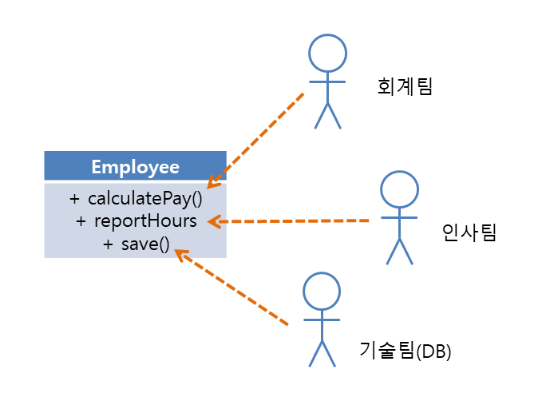
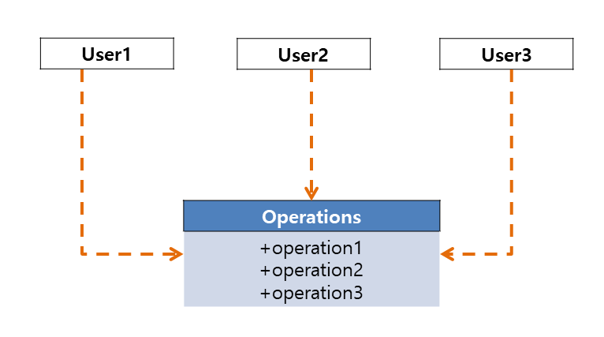
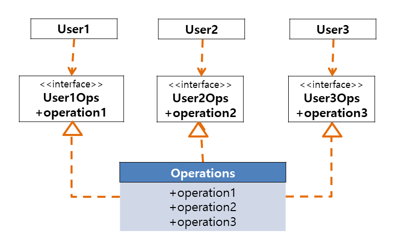
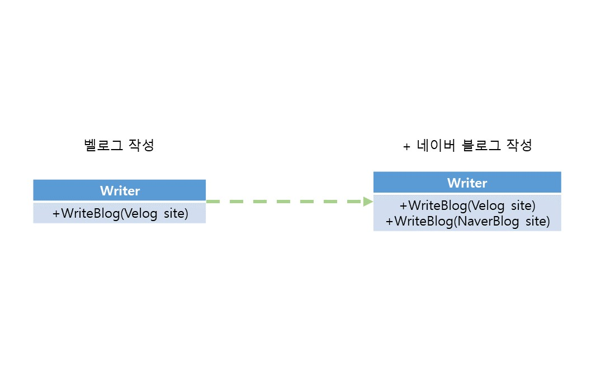
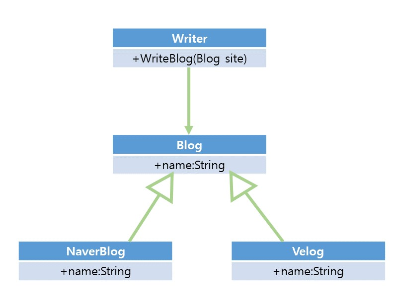

# SOLID 객체지향설계원칙

<aside>
📌 SOLID 원칙은 함수와 데이터 구조를 클래스로 배치하는 방법, 클래스를 서로 결합하는 방법을 설명한다.

</aside>

## 목적

중간 수준의 소프트웨어(모듈 수준에서 작업)  구조에 적용됨 ⇒ 모듈과 컴포넌트 내부에서 사용되는 소프트웨어 구조를 정의

- 특징
    1. 변경에 유연
    2. 이해하기 쉽다
    3. 많은 소프트웨어 시스템에 사용될 수 있는 컴포넌트의 기반이 됨

## 종류

### SRP(Single Responsibility Principle) : 단일 책임 원칙

> **함수**는 반드시 하나의 일만 해야한다.
⇒ 하나의 모듈은 하나의 액터에 대해서만 책임져야한다.
> 
- 모듈 : 함수와 데이터 구조로 구성된 `응집된` 집합
    - 응집된(cohensive, 응집성) : 한 모듈 내부의 처리 요소들간 기능적 연관도, 모듈 안의 구성 요소들이 공동의 목적을 달성하기 위해 관련되어있는 정도
    - 모듈보다 상위의 컴포넌트 수준에서는 공통 폐쇄 원칙(Common Closure Principle)으로 적용된다.
- SRP 위반 징후
    1. **우발적 중복** : 한 모듈 안의 메서드가 여러 액터를 책임짐
        
        
        
    
    ⇒ 서로 다른 액터가 의존하는 코드를 서로 분리해야한다. 
    
    1. **병합** : 많은 사람이 서로 다른 목적으로 동일한 소스 파일을 변경 시도
    
    ⇒ 서로 다른 액터를 뒷받침하는 코드를 서로 분리(메서드를 각기 다른 클래스로 이동)
    
    - 이를 위해 Facade 패턴을 흔히 사용한다.
        - Facade 패턴 : 복잡한 시스템을 단순한 인터페이스로 추상화해 사용자 혹은 클라이언트가 시스템을 쉽게 사용할 수 있도록 하는 것

### OCP(Open-Closed Principle) : 개방-폐쇄 원칙

> 소프트웨어 개체(artifact)는 `확장`에는 열려있어야하고, `변경`에는 닫혀있어야한다. 
⇒ 소프트웨어 개체의 행위는 확장할 수 있어야하나 개체를 변경해서는 안된다.
> 

컴포넌트 단위로 시스템을 분리하고 저수준 컴포넌트에서 발생한 변경으로부터 고수준 컴포넌트를 보호할 수 있는 형태의 의존성 계층구조가 형성되도록 해야함 

- 클래스와 모듈을 설계할 떄 보다 아키텍처 컴포넌트 수준에서 OCP를 고려할 때 더 중요하게 작용
- **동작방식**
    - 기능이 어떻게(how), 왜(why), 언제(when) 발생하는지에 따라 기능을 분리
    - 분리한 기능을 컴포넌트의 계층구조로 조직화
        - 계층구조로 조직화해 저수준 컴포넌트에서 발생한 변경으로부터 고수준 컴포넌트를 보호 가능
- **방향성 제어**
    - 컴포넌트간 의존성의 방향을 적절한 방향으로 제어해야한다.
        - 인터페이스는 이 의존성을 역전하는데 사용될 수 있음
- **정보은닉**
    - 하위 개체에서 발생한 변경으로부터 상위 개체를 보호하는 일의 우선순위가 가장 높다.
    - 상위 개체에서 발생한 변경으로부터도 하위 개체를 보호할 필요가 있다.
    
    ⇒ `인터페이스` 등을 활용해 상위 개체 내부를 은닉하는 것으로 해결
    
    - 인터페이스 : 추상화를 통해 사용자와 동작이 분리되어 인터페이스의 구현체가 변경되더라도 사용자는 동작의 변경 내용을 알 수가 없다. ⇒ 변경에 대한 의존성이 사라짐

### LSP(Liskov Substitution Principle) : 리스코프 치환 원칙

> 하위 타입(subtype)에 관한 원칙, 상호 대체 가능한 구성요소를 이용해 소프트웨어 시스템을 만들 수 있으려면 구성요소는 반드시 서로 치환 가능해야한다. 
⇒ 하위 타입은 언제나 상위 타입을 대체할 수 있어야한다.
> 
- e.g. 정사각형과 직사각형
    - 정사각형은 직사각형의 자식 타입으로 볼 수 있으며 정사각형은 직사각형이 될 수 있다.
- LSP는 반드시 아키텍처 수준까지 확장할 수 있어야한다.
    - LSP를 위배하게 된다면 시스템 아키텍처가 오염되어 별도 매커니즘을 추가해야하게 된다.

### ISP(Interface Segregation Principle) : 인터페이스 분리 원칙

> 소프트웨어 설계자는 사용하지 않은 것에 의존하지 않아야한다.
> 

<table><thead><tr><th>
</th><th></th></tr></thead>
  <tr><td>그림2</td><td>그림3</td></tr></table>

그림2의 경우 user2가 사용하는 operation2를 변경하게되면 user1은 operation2와 operation3에도 의존하고 있어 user1의 변경사항이 없어도 user1을 다시 컴파일한 후 새로 배포하게 된다.

- 오퍼레이션을 인터페이스 단위로 분리한 그림3의 경우 Operation의 변경은 user1에 아무런 영향을 주지 않게된다(분리)

### DIP(Dependency Inversion Principle) : 의존성 역전 원칙

> `고수준` 정책을 구현하는 코드는 `저수준` 세부사항을 구현하는 코드에 절대로 의존해서는 안되며 세부사항은 정책에 `의존`해야한다.
> 
- 의존성 : 클래스 A가 클래스 B의 메서드를 호출하는 등 클래스 A를 실행하기 위해 클래스 B가 필요한 상황을 클래스 A가 클래스 B에 의존한다고 말한다.
- 고수준과 저수준의 클래스는 추상화 수준에 따라 결정된다.
    - 고수준의 클래스는 저수준의 클래스보다 추상화 수준이 높다.

의존성 역전 없이는 고수준의 모듈은 저수준의 모듈에 의존하는 구조로 작성되게 된다.

<table><thead><tr><th>
</th><th></th></tr></thead>
  <tr><td>그림4</td><td>그림5</td></tr></table>

- e.g.
    - 그림4 처럼 사용자가 벨로그를 작성하는 WriteBlog 메서드가 있다고 가정했을때 네이버 블로그를 작성하기 위해서는 네이버 블로그를 파라미터로 받는 WriteBlog 메서드를 추가로 작성하게된다. 이후 플랫폼을 변경할 때마다 새로운 코드를 추가로 작성하게 될 것이다.
    - 그림5는 그림 4의 DIP 위반 상황을 수정하여 Blog라는 추상화된 클래스에 Writer가 의존하도록 변경하고 Blog를 상속받아 사이트를 구현하도록 했다. 이를 통해 사이트 변경에 의한 Writer 코드의 수정이 발생하지 않게 되었다.
- 의존성 역전 원칙을 만족하도록 코드를 작성하면 유연한 코드를 작성할 수 있게된다.