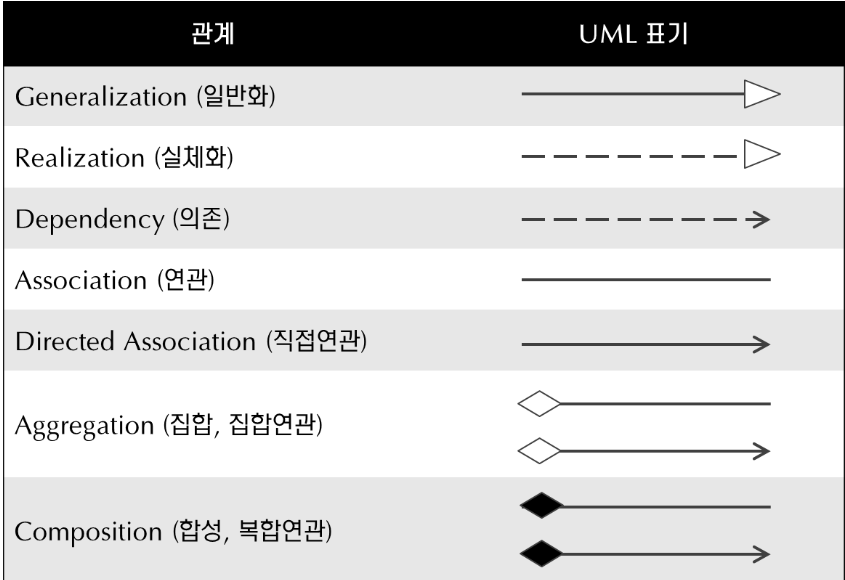

# 클래스 다이어그램
> 본격적으로 디자인 패턴을 학습하기에 앞서 설명을 위해 자주 사용되는 클래스 다이어그램에 대해 가볍게 정리한다.
> 

## UML(Unified Modeling Language)

개발 프로젝트를 위한 설계도이다. 모델링을 위한 표준 언어로 개발자들 사이 생각의 불일치를 줄여 작업 효율을 높이기 위해 등장했다. 

### 종류(14 中 3)

- 행위 다이어그램
    - Use Case UML : 사람과 역할을 중심으로 서비스를 시각화
    - Sequence UML : 데이터의 흐름, 순서를 시각화
- 구조 다이어그램
    - Class UML : 정보들 간의 관계를 시각화

## 클래스 다이어그램

### Element

- **Class**
    
    
    | 이름(클래스이름) |
    | --- |
    | 속성(변수) : 자료형 |
    | 기능(메서드) : 반환값 |
    
    ```java
    접근제한자 class 클래스 이름{
    	자료형 변수1;
    	자료형  변수2;
    	접근제한자 반환값 메서드명1([파라미터]){}
    	접근제한자 반환값 메서드명1([파라미터]){}
    }
    ```
    
    보통 이름, 속성, 기능의 세 구획을 사용하지만 필요에 따라 구획을 추가할 수 있다. 
    
    - 접근 제한자(Access modifier) (`-` private, `+` public, `#` protected, `~` default)
    - 필드명(메서드명)
    - 자료형
    - 반환
- **Stereo Type**
    
    다른 모델 요소의 용도를 식별하는 모델 요소
    
    - UML 모델 요소에 추가적인 의미, 목적 등 UML에서 표현하지 못하는 내용을 추가
    - `<<content>>` 형식으로 작성됨
    - interface, utility, abstract, enumeration 등
        - 추상(abstract)의 경우 italic체나 abstract 프로퍼티, stereo type 등을 이용해 표기
- **관계**
    
    
    
    출처 - [4. 클래스간의 관계](https://www.nextree.co.kr/p6753/)
    
    - Generalization(일반화) : 상속(Inheritance) 관계를 나타냄, 자식 is a 부모 관계
        
        ↔ Specialize(구체화) : 자식은 부모로 일반화되고, 부모는 자식으로 구체화된다. 
        
    - Realization(실체화) : interface의 추상 메서드를 구현하는 것, 자바의 implements
    - Dependency(의존) : 한 클래스가 다른 클래스를 참조하는 것
        - 참조 : 메서드 내에서 대상 클래스의 객체 생성, 객체 사용, 메서드 호출, 객체 리턴, 매개변수로 객체 사용 등
    
    <aside>
    ✅ **Composition ⊂ Aggregation ⊂ Association**
    
    </aside>
    
    - Association(연관): 다른 객체의 참조를 가지는 필드
        - Directed Association(직접 연관)은 Association과 달리 방향성(navigability, 참조하는 쪽과 참조 당하는 쪽 구분)을 지님
        - 의존 vs 연관
            
            
            |  | 의존 |  연관 |
            | --- | --- | --- |
            | 공통점 | 한 클래스가 다른 클래스의 기능을 사용 | 한 클래스가 다른 클래스의 기능을 사용 |
            | 관계의 유지 | 짧다 : 오퍼레이션/메서드 일부로 일시적 |  길다 : 의도적으로 참조를 교체하지 않는 이상 관계가 유지됨  |
    - Aggregation(집합) : 연관 관계를 특수하게 나타냄(전체과 부분의 관계, 포함 관계를 표현(부분집합), A ⊂ B)
    - Composition(구성) : 하위 집합이 상위 집합에 대해 종속적으로 상위 집합이 하위 집합의 생명주기(Life Cycle)을 관장