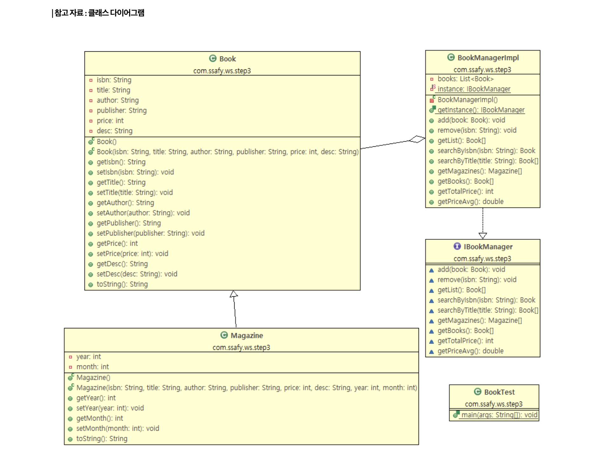
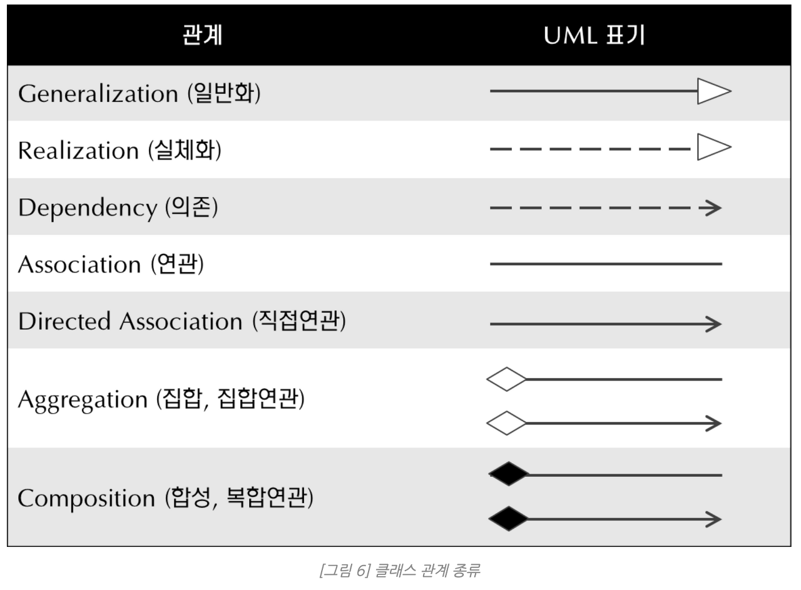
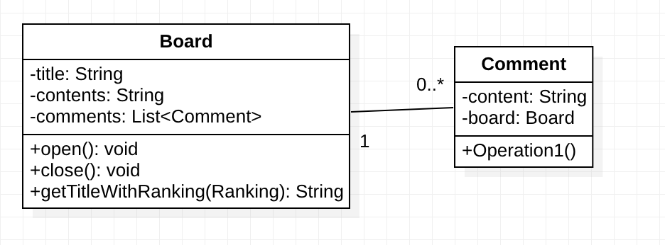
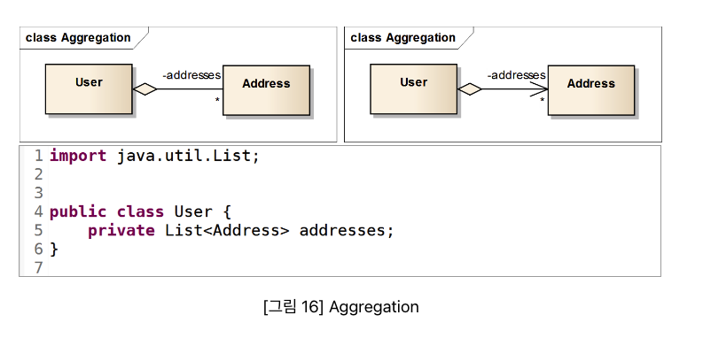
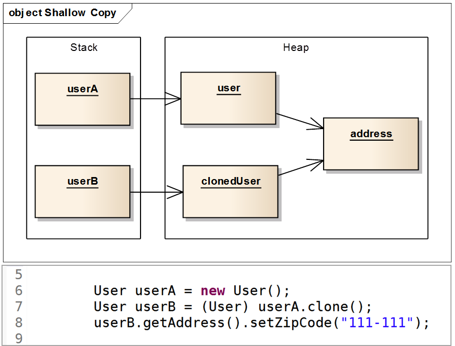
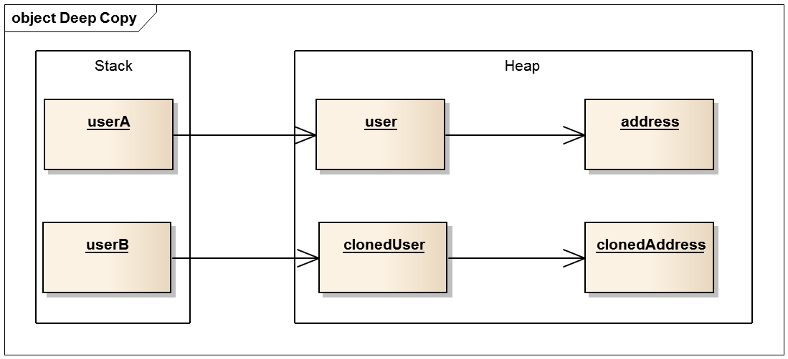

# 클래스 다이어그램

UML 다이어그램의 종류 중 하나!

UML이란? 도메인(해결하고자 하는 목표, ex) 결재시스템 등)을 모델로 표현해주는 대표적인 모델링 언어
 - 의사소통 또는 설계 논의를 위해
 - 전체 시스템의 구조 및 클래스의 의존성 파악을 위해
 - 유지보수를 위한 설계의 back-end 문서 제작을 위해

UML(Unified Modeling Language)이란? **소프트웨어 시스템을 개발하는 과정에서 산출물의 명세화, 시각화, 문서화할 때 사용하는 모델링 언어**로써 하나의 시스템을 표현하기 위한 표준적인 방법을 제공하기 위해서 만들어 졌다. 크게 구조, 행위 두 가지 다이어그램으로 구성되어 있음. 

클래스 다이어그램은 구조 다이어그램으로 클래스의 속성, 함수, 변수타입들로 구성된 다이어그램이다.

## 클래스 다이어그램의 기본요소

클래스에는 클래스의 이름, 속성, 그리고 메서드가 존재! 이를 표현할 방법!

1. 접근제어자 리스트
+ : public
- : private
# : protected
2. 형식
- 속성(Attribute)
 >> 접근제어자 이름: 타입 = 기본값
     ex) -title: String = “”
- 메서드
 >> 접근제어자 이름(파라미터 속성): 리턴값
     ex1) +setTitle(String)
     ex2) +gettitle():String
- interface, abstract
 >> ex) <<interface>> 또는 <<abstract>>

## 클래스 다이어그램을 이용한 관계 표현

1. 일반화 - 부모클래스와 자식클래스간의 상속관계를 나타냄
2. 실체화 - 오버라이딩(interface의 명세,정의만 있는 메서드를 오버라이딩하여 실제 기능으로 구현)
3. *의존* - 클래스간의 참조(메서드 내에서 대상 클래스의 객체를 생성하거나 사용, 리턴받아 사용하는 것을 말함. 그러나 해당 클래스와의 관계를 계속 유지하지는 않음.)
4. 연관, 직접연관 - 다른 객체의 참조를 가지는 필드. (대상 클래스의 가질 수 있는 인스턴스의 개수 범위)
1 : 1개를 가짐
* : 0~n개를 가짐
n…m : n부터 m개까지 연관관계를 맺음
화살표가 있는 것은 참조 하는 쪽과 참조 당하는 쪽을 구분하게 함.(직접연관)
아래의 그림은 양방향 연관관계. 1(Board) : n(Comment)의 관계를 표시한 것

1. 집합, 집합연관 - association의 집합관계를 나타내는 것으로 colleciton(Collection Framework에는 
List, Set, Map, Queue, Stack 등 있음)이나 array를 이용하는 관계.
aggregation(집합)은 실선에 빈 다이아몬드
연관과 집합은 집합이라는 개념적인 차이는 있지만, 코드에서는 이 차이를 구분하기 힘들다!! >> UML은 집합이라는 개념 외에 명확한 aggregation의 정의를 제공하지 않다. 그래서 자기 나름의 정의가 많음 > 혼란유발
    
    
    
2. 합성, 복합연관
- composition(합성)은 집합과 비슷하게 집합관계를 나타내지만 클래스의 연관관계에서 강한 결합의 관계를 의미.
- 실선에 채워져있는 다이아몬드
- 강한 집합이란 part가 whole에 종속적임!! (집합에서는 part를 whole에서 빌려쓰는 것)
 >> part가 가지는 whole의 인스턴스가 part인스턴스의 전체 수명을 책임짐
      >> whole인스턴스가 part인스턴스생성, 소멸되면 같이 소멸, 복사되면 같이 복사.

 >> part에 해당하는 인스턴스는 공유 될 수 없음

이건 클래스다이어그램아니고 객체 다이어그램으로 객체 표현한 그림!!
참조변수인 userA가 참조하고 있는 user객체를 복사하여 clonedUser객체를 만들고, 참조변수 userB에서 클론드유저를 참조하고 있음. user객체는 보가가 제대로 됐으나, user객체 안에서 참조하고 있는 주소는 clonedUser객체도 똑같이 참조하고 있음 ㅠㅠ 이를 얕은복사라고 한다!! 이 경우에는 part에 해당하는 주소가 공유된 것임. 

user가 복사되어 clonedUser객체가 생성될 때 유저 객체가 참조하여 가지고 있는 주소또한 같이 복사되어 clonedUSer 객체는 새로운 clonedAddress객체를 참조하여 가지고있다! 이건 깊은 복사!!

>> composition에서는 개발자가 구현해야할 부분이 몇가지 있음. 위의 깊은 복사 구현과 part를 가지는 whole인스턴스가 파트 인스턴스의 수명 전체를 책임져야한다는것에 따라 whole클래스의 생성자 또는 기타 메서드 내에서 part인스턴스를 생성해야 하고 외부에서 part객체를 생성하지 못하도록 whole클래스에는 part인스턴스에 대한 setter가 있으면 안된다!!!!!!!!!! (자바에서는 GC가 객체소멸을 담당하므로 part인스턴스 소멸은 신경안써도돼)

참조:[https://seulhee030.tistory.com/56](https://seulhee030.tistory.com/56)
[https://sabarada.tistory.com/72](https://sabarada.tistory.com/72)

[https://www.nextree.co.kr/p6753/](https://www.nextree.co.kr/p6753/)